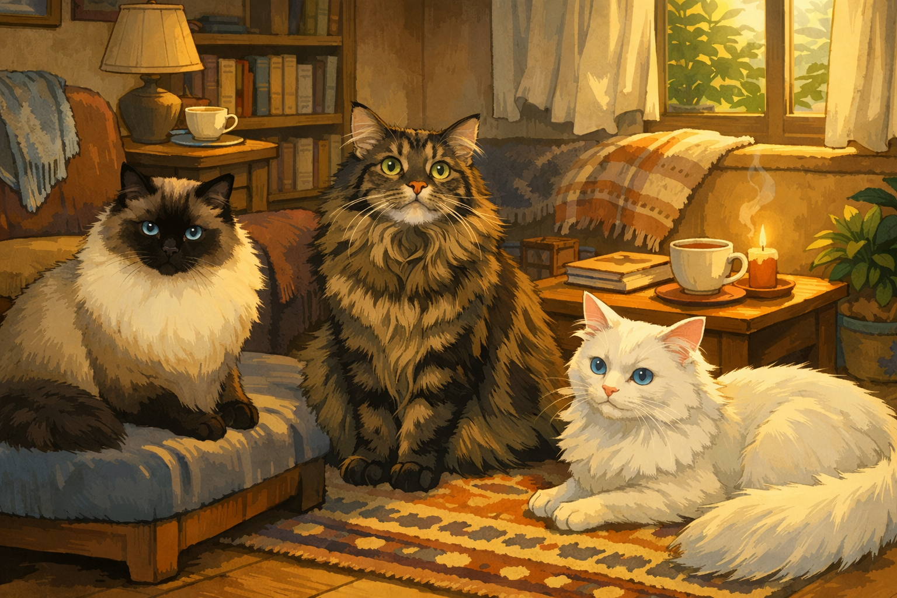

<!-- Replace placeholders (e.g. YOUR_NAME, YOUR_USERNAME, YOUR_LINKEDIN, etc.) with your actual details -->

<h1 align="center">Hey there 👋</h1>

---

<h2>About Me</h2>

<h3>I Enjoy Coding</h3>

<big>I love building software. To me, building things is the only way to turn ideas into something real and make a difference in the world.</big>

<big>I mostly build in Python, but lately, I’ve been learning Rust—partly because Rust is quietly powering much of the modern Python ecosystem, and partly because I enjoy a good intellectual challenge. In an age where “vibe coding” with AI is taking over, wrestling with Rust feels like a refreshing workout for the brain.</big>

<!-- <h3>My Stance on Vibe Coding</h3>

<big>When it comes to LLM, I use it at work to boost efficiency (with careful review, of course), but I try to avoid it in my side projects(or only use it for learning by asking questions). I still genuinely enjoy coding by hand—digging through documentation, figuring things out, and feeling that little spark when something finally works.</big>

<big>That said, if we ever reach a point where Markdown is the only language we use to “code,” I might hang up my keyboard and become a carpenter—building cat trees for my three cats instead of software.</big>
 -->
 

  

<h2>Projects</h2>

<table role="table">
  <thead>
    <tr>
      <th width="33%"></th>
      <th width="33%"></th>
      <th width="33%"></th>
    </tr>
  </thead>
  <tbody>
    <tr>
      <td align="center" valign="top">
        
         
        <strong><a href="https://github.com/nordicsushi/async-youtube-transcript">Youscript</a></strong>
         
        <small>An asynchronous Youtube transcript downloader.</small>
      </td>
      <td align="center" valign="top">
        
         
        <strong><a href="https://github.com/nordicsushi/bili_up_finder">Influencer Radar</a></strong>
         
        <small>An AI-powered search engine to target relevant influencers.</small>
      </td>
      <td align="center" valign="top">
        
         
        <strong><a href="https://github.com/nordicsushi/shell-ai">Shell.AI</a></strong>
         
        <small>A shell built in rust that translates natural language into bash command.</small>
      </td>
    </tbody>
</table>

  

